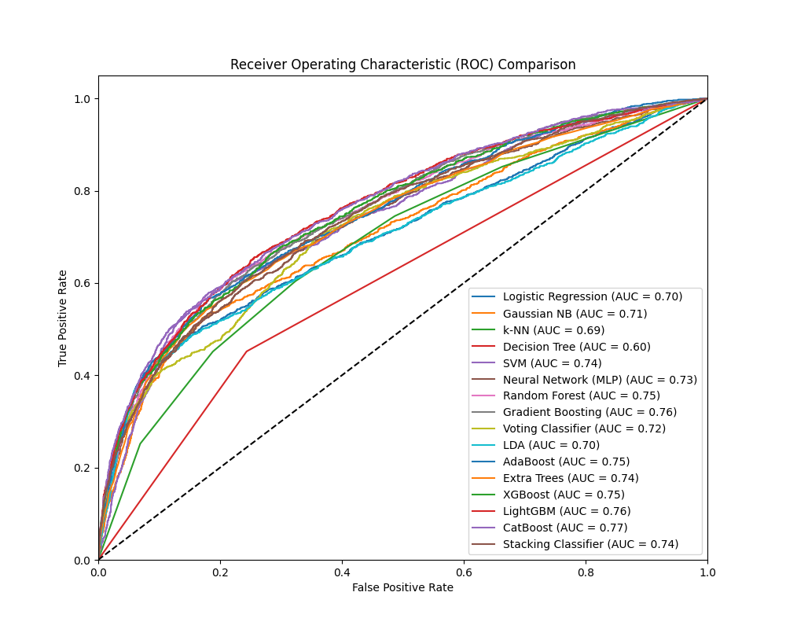

# Credit Default Model Analysis


A comprehensive machine learning analysis to predict credit card default using the **UCI Credit Card Clients dataset**. This project compares baseline linear models, non-linear algorithms, and advanced ensemble methods (like XGBoost, LightGBM, CatBoost), with a focus on **Recall** and **ROC-AUC** to address financial risk and class imbalance. It implements automated hyperparameter tuning via `RandomizedSearchCV` for state-of-the-art tree models.

## 📊 Key Results

After incorporating and tuning advanced ensemble models, Gradient Boosted Trees consistently dominated the classic baseline models. Here are the comprehensive evaluation metrics for all 17 models on the test set, sorted by ROC-AUC:

| Model | Accuracy | Precision | Recall | F1-Score | ROC-AUC |
| :--- | :--- | :--- | :--- | :--- | :--- |
| **Gradient Boosting** | 81.72% | 0.6615 | 0.3549 | 0.4620 | **0.7785** |
| **XGBoost** | 81.85% | 0.6686 | 0.3557 | 0.4643 | **0.7775** |
| **CatBoost** | 76.37% | 0.4739 | **0.6217** | 0.5378 | **0.7767** |
| **LightGBM** | 75.75% | 0.4638 | 0.6172 | 0.5296 | **0.7767** |
| **Random Forest** | 78.73% | 0.5174 | 0.5720 | **0.5433** | 0.7757 |
| **AdaBoost** | 81.72% | 0.6753 | 0.3338 | 0.4468 | 0.7685 |
| **Extra Trees** | 80.95% | 0.6207 | 0.3564 | 0.4528 | 0.7523 |
| **Stacking Classifier** | 76.10% | 0.4665 | 0.5622 | 0.5099 | 0.7486 |
| **SVM** | 77.97% | 0.5018 | 0.5373 | 0.5189 | 0.7419 |
| **Gaussian NB** | 75.18% | 0.4504 | 0.5539 | 0.4968 | 0.7248 |
| **Voting Classifier** | 76.62% | 0.4650 | 0.3806 | 0.4186 | 0.7122 |
| **Logistic Regression** | 67.97% | 0.3672 | 0.6202 | 0.4613 | 0.7084 |
| **Ridge Classifier** | 68.45% | 0.3708 | 0.6119 | 0.4618 | 0.7059 |
| **LDA** | 80.90% | **0.6814** | 0.2562 | 0.3724 | 0.7020 |
| **k-NN** | 79.27% | 0.5489 | 0.3512 | 0.4283 | 0.7017 |
| **SGD Classifier** | 79.83% | 0.5569 | 0.4318 | 0.4864 | 0.7013 |
| **Decision Tree** | 72.88% | 0.3867 | 0.3858 | 0.3863 | 0.6059 |

> **Insight**: While Gradient Boosting and XGBoost provide the best overall ranking capability (AUC), models like CatBoost, LightGBM, and Random Forest attained significantly higher F1-Scores. This indicates they successfully identified a much larger proportion of actual defaults (higher Recall) at the expense of false positives, making them exceptionally strong candidates for practical risk mitigation.

## 🚀 Project Structure

```
├── data/               # Dataset storage
│   ├── raw/            # Original UCI dataset
│   └── processed/      # Cleaned & split CSVs (X_train, y_train, etc.)
├── notebooks/          # Exploratory analysis
│   └── 01_EDA_and_Modeling.ipynb # Interactive EDA and modeling demo
├── reports/            # Generated figures, CSVs, and final analysis
│   ├── figures/        # Confusion matrices for all 18 models
│   ├── model_comparison.csv # Raw evaluation metrics
│   ├── roc_curves.png  # Consolidated ROC curves
│   └── final_report.md # Detailed research analysis
├── src/                # Modular source code
│   ├── data_loader.py  # Data ingestion
│   ├── models.py       # Model definitions and hyperparameter grids
│   ├── preprocessing.py# Data cleaning & scaling
│   └── evaluation.py   # Metric calculation
├── main.py             # Master script to run the full training pipeline
└── requirements.txt    # Project dependencies (includes xgboost, lightgbm, catboost)
```

## 🛠️ Installation & Usage

1.  **Clone the repository**
    ```bash
    git clone https://github.com/R1NCwasUnavailable/Credit-Default-Model-Analysis.git
    cd Credit-Default-Model-Analysis
    ```

2.  **Install dependencies**
    ```bash
    pip install -r requirements.txt
    ```

3.  **Run the analysis**
    This script will download the data (if missing), preprocess it, automatically tune specific models using `RandomizedSearchCV`, train all 18 models, and generate the reporting artifacts.
    ```bash
    python main.py
    ```

4.  **View Results**
    Check the `reports/` directory for `model_comparison.csv` and generated plots.

## 📈 Visualizations

**ROC Curves Comparison**


## 📝 Methodology
-   **Preprocessing**: Stratified 80/20 split, Standard Scaling (for distance-based models like SVM/k-NN), Class Weight Balancing.
-   **Baseline & Linear Models**: Logistic Regression, Naive Bayes, Ridge Classifier, SGD Classifier, LDA.
-   **Non-Linear Models**: k-NN, Decision Tree, SVM.
-   **Ensemble Models**: Random Forest, Gradient Boosting, AdaBoost, Extra Trees, XGBoost, LightGBM, CatBoost, Voting Classifier, Stacking Classifier.
-   **Optimization**: 
    - `RandomizedSearchCV` was used extensively to optimize hyperparameters for tree-based ensemble models with 10 iterations and 3-fold cross-validation.
    - Stratified subsampling was used for computationally expensive models (like SVM) to enable probability calibration within reasonable training time.

## 🤝 Contributing
Feel free to open issues or submit pull requests with additional feature engineering concepts or broader tuning grids.

## 📄 License
MIT
